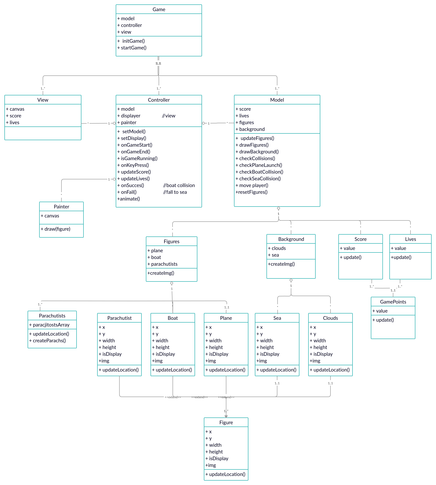

Catch the parachutists that jump from the plane into your boat!
Play it live here

# Structure



The main component is the ”Game” class that holds 3 fields: View, Model and Controller. These fields are separated components, each has its own responsibility.

##  View  
Responsible for displaying the view of the game including the figures, background, the current score and lives left.
It holds a canvas that renders the visual part. The canvas gets cleared every frame and the new picture of the game being drawn.

## Model
Holds all the data for the game in separate containers. Responsible for all the updates and calculation of that data. It contains the figures data, for instance, the location coordinates, thiers mesures, source image etc. It also contains data about background images. Responsible for update scores and lives. The figures and background classes all extend the “Figure” class providing a common interface.
Other main responsibility of the model is to check collisions: between parachutists and the boat/sea/plane launch.

## Controller
Controller is the manager of the game.
It is responsible for communication between the view and the model, it listens to changes(events) and calls the adequate methods accurately.
The controller also holds the “Painter” components that holds a canvas instance and have single responsibility - draw into the canvas, this way we keep the model decoupled from the canvas(view) so it allows us to easily make changes in each part of the game.

# Installation and running
Run in terminal:
```
npm install http-server -g
cd PROJECT_DIRECTORY
http-server 
```
